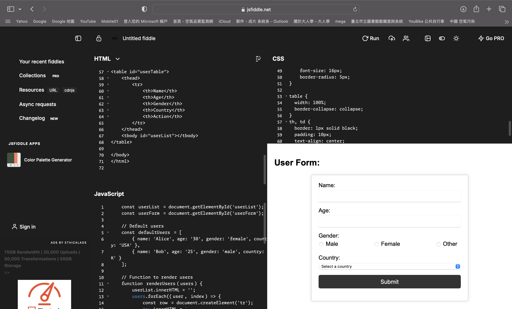

## Objective
Demonstration on web program with plain HTML / CSS / Javascript.

## Run on fiddle

### Website
https://jsfiddle.net/

### Demo


## Features used

- [x] form
- [x] input
- [x] radio
- [x] select
- [x] button
- [x] table
- [x] list
- [ ] file

### form
```html
<form id="userForm" action="#" method="POST">
    /* contents ... */
</form>
```

### input
```html
    <div class="form-group">
        <label for="name">Name:</label>
        <input type="text" id="name" name="name" required>
    </div>
```

### radio
```html
    <div class="form-group">
        <label>Gender:</label>
        <div class="radio-group">
            <label for="male">
                <input type="radio" id="male" name="gender" value="male" required> Male
            </label>
            <label for="female">
                <input type="radio" id="female" name="gender" value="female" required> Female
            </label>
            <label for="other">
                <input type="radio" id="other" name="gender" value="other" required> Other
            </label>
        </div>
    </div>
```

### select
```html
    <div class="form-group">
        <label for="country">Country:</label>
        <select id="country" name="country" required>
            <option value="">Select a country</option>
            <option value="TAIWAN">Taiwan</option>
            <option value="USA">United States</option>
            <option value="CANADA">Canada</option>
            <option value="UK">United Kingdom</option>
            <option value="AUSTRALIA">Australia</option>
            <option value="INDIA">India</option>
        </select>
    </div>
```

### button
```html
    <div class="form-group">
        <button type="submit">Submit</button>
    </div>
```

### table
javascript
```javascript
  filteredUsers.forEach((user, index) => {
    const row = document.createElement('tr');
    row.innerHTML = `
                <td>${user.name}</td>
                <td>${user.age}</td>
                <td>${user.gender}</td>
                <td>${user.country}</td>
                <td><button onclick="deleteUser(${index})">Delete</button></td>
            `;
    userList.appendChild(row);
  });
```

### 3rd party feature
toolcool-range-slider (official website) \
https://github.com/mzusin/toolcool-range-slider
\
html
```html
<tc-range-slider 
  id="slider"
  min="0" 
  max="150" 
  value1="10"
  value2="100"
  generate-labels-units=" years"
  generate-labels="true">   
</tc-range-slider>
<script 
  src="https://cdn.jsdelivr.net/npm/toolcool-range-slider/dist/plugins/tcrs-generated-labels.min.js"></script>
<script src="https://cdn.jsdelivr.net/npm/toolcool-range-slider/dist/toolcool-range-slider.min.js"></script>
```
javascript
```javascript
const $slider = document.getElementById('slider');
/* deal with $slider.value1 $slider.value2 ... */
```

## Useful reference

### Useful plain html code / tutorial
https://github.com/samson0512?tab=repositories

### Interesting game constructed via plain html 
https://github.com/he-is-talha/html-css-javascript-games/blob/main/README.md
